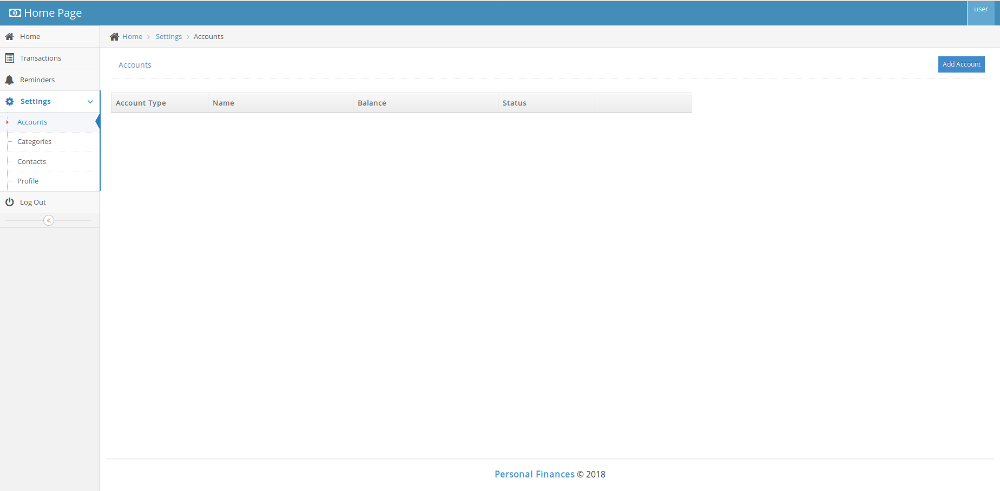
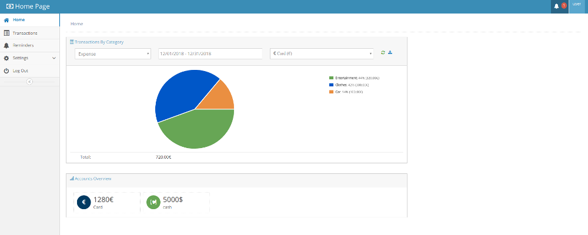

## Project Overview

Introducing Budget Buddy, your ultimate companion for managing personal finances easily and confidently. Designed to simplify budgeting and financial planning, Budget Buddy helps you track expenses, set savings goals, and monitor your progress in real-time. With intuitive charts and personalized insights, you can make informed decisions and stay on top of your financial health. Whether you're saving for a big purchase or just trying to keep within your monthly budget, Budget Buddy provides the tools and support you need. Join the community of savvy savers and take control of your finances with Budget Buddy today! We are excited to help you!

## Setup Used

- Java 11
- Javascript
- HTML
- CSS
- MySql
- Apache Tomcat

### Instructions

Follow the following steps to configure and run the script:

# Step 1: Enter the setup/db/ folder and execute:

database_schema.sql
inserts.sql

# Step 2: Choose your preferred settings:

application.properties 

# Step 3.1: Run the script from the IDE:

SPRING_CONFIG_LOCATION=/PATH_TO/HOME/config/
SPRING_CONFIG_NAME=application

# Step 3.2: Run the script from the terminal:

 java -jar personalfinances.jar --spring.config.location=/PATH_TO/HOME/config/ --spring.config.name=application

